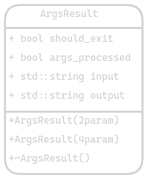

# Args
``mtv::Args``

[***args.hpp***](../source/args/args.hpp) | [***args.cpp***](../source/args/args.cpp)

Esta clase está enfocada en el procesamiento de los argumentos pasados al programa.
Procesa principalmente 4 argumentos:

- ``-h`` o ``--help``: Muestra la ayuda del programa.
- ``-v`` o ``--version``: Muestra la versión del programa.
- ``-i`` o ``--input``: Especifica el archivo de entrada.
- ``-o`` o ``--output``: Especifica el archivo de salida.

Al ingresar los 2 primeros el programa concluye, sin embargo, si se especifica un archivo
de entrada y no se especifica un archivo de salida, el programa imprimirá el resultado en
la consola. Cabe aclarar que es necesario especificar un archivo de entrada para que
el programa pueda funcionar correctamente, caso contrario se mostrará un mensaje de error.

El módulo permite el ingreso de archivos tanto en sistemas Windows como en sistemas
Linux, ya que se encarga de obtener la ruta absoluta del archivo.

Al usarse, el módulo retorna una instancia de la estructura ``ArgsResult`` que contiene
los argumentos procesados y booleanos para indicar al programa si debe detenerse.

# ArgsResult 
``mtv::Args::ArgsResult``

Esta estructura contiene los argumentos procesados y 2 booleanos
(``args_processed``y`should_exit`). El primero indica si los argumentos fueron
procesados mientras que el segundo si el programa debe detenerse.
En caso de que los argumentos no sean procesados, el programa debe detenerse. En caso
de que los argumentos sean procesados, pero las funciones de ayuda o versión sean las
ejecutadas, el programa también debe detenerse (``should_exit``).

