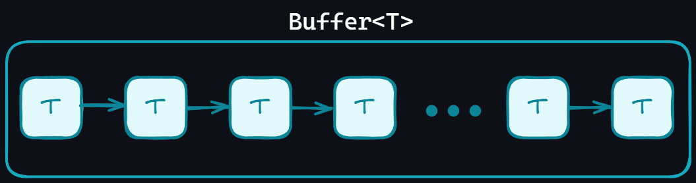

# Buffer ``mtv::Buffer<T>``

La estructura buffer es intrínsecamente una lista enlazada que almacena cualquier tipo
de dato, con la característica de que solo existe una instancia por cada tipo de dato
que se maneje.

## Tarea Principal

Almacenar datos en una instancia segura e independiente tanto del tipo de dato que se
maneje como del contexto en el que se necesite.

## Características

El buffer aplica el patrón de singleton, sin embargo, al ser una plantilla o *template*
tiene ligeras diferencias con respecto a otras clases que no son *templates*. La
primera es que el compilador genera una instancia por cada tipo de dato que se maneje,
y la segunda es que cada instancia es independiente de las demás.

Al ser una clase extendida de una ``LinkedList``, el buffer tiene acceso a los
iteradores de la misma y se pueden usar de manera similar.

***Nota***: Más información en [LinkedList](./linkedlist&nodes.md)