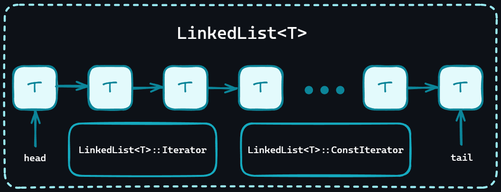

# LinkedList ``mtv::LinkedList<T>``

LinkedList es una estructura de tipo lista que se ha implementado para el manejo de
información en el proyecto. La lista enlazada es una estructura de datos que consiste
en [nodos](#node-mtvnodet) que contienen un valor y un puntero al siguiente nodo.

## Tarea Principal

Como se mencionó anteriormente, esta lista fue implementada para el almacenamiento de
datos, pero también para un menor consumo de la memoria (en comparación con los
*arrays*) cuando la estructura es dinámica.

Las linked list proporcionan además subclases para un mejor recorrido de datos. Tales
clases son [`Iterator`](#iterator-mtvlinkedlisttiterator)
y [`ConstIterator`](#constiterator-mtvlinkedlisttconstiterator).

## Características

Las linked list emplean el patrón de diseño *Iterator* para el recorrido de los nodos.
También se empleó el patrón de diseño *Factory* para la creación de instancias de
listas y nodos.

# Iterator ``mtv::LinkedList<T>::Iterator``

**Iterator** es una subclase de ``LinkedList`` que permite recorrer los nodos de la
lista, siento estos elementos mutables. Los iteradores permiten el uso del bucle
``foreach`` en ``LinkedList``. Se componen de punteros a nodos y métodos de
pre-incremento y post-incremento para la obtención del siguiente nodo.

# ConstIterator ``mtv::LinkedList<T>::ConstIterator``

**ConstIterator** es subclase de ``LinkedList``, similar a ``Iterator``,
``ConstIterator`` permite recorrer la lista de una manera segura y eficiente, con la
diferencia de que los elementos no son mutables. Se componen de punteros a nodos y
métodos para el recorrido al final de la lista

# Node ``mtv::Node<T>``

Son las clases que componen la lista enlazada. Cada nodo contiene un valor y un
puntero al siguiente nodo. Los nodos aplican el patrón de diseño Factory para su creación
y se pueden crear instancias de nodos con cualquier tipo de dato.