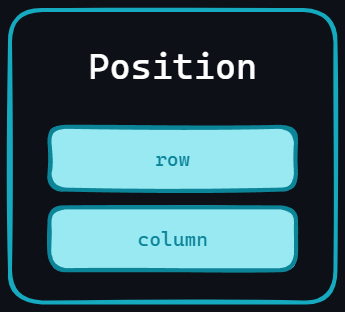

# Position ``mtv::Position``

Estructura básica para almacenar la posición de un caracter en un archivo.
Consta de 2 atributos:

- `row`: Fila en la que se encuentra el caracter.
- `column`: Columna en la que se encuentra el caracter.

Ambos de tipo `size_t` (`unsigned long long int`).

