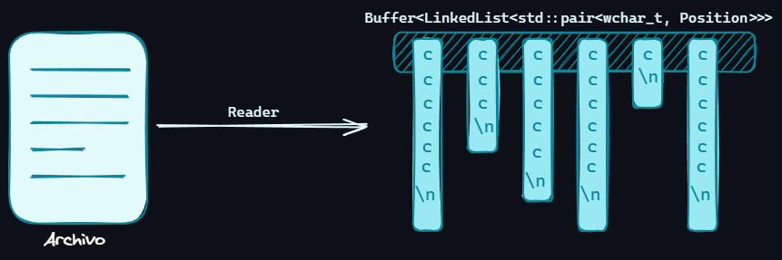

# Reader ``mtv::Reader``

La clase reader es la que tiene la tarea de leer el archivo y guardarlo en una
estructura `Buffer`.

## Tarea Principal

Convertir el archivo a una estructura `Buffer<LinkedList<std::pair<wchar_t,
Position>>>` y limpiar los comentarios y líneas vacías que se encuentre.

<div style="text-align: center;">

</div>

## Características

La clase `Reader` implementa el patrón de diseño *Singleton*.

## Función `verify()`

Esta función retorna un booleano que indica si el archivo existe o no. En caso de no
existir el programa mostrará el mensaje de error y finalizará.

```cpp
bool Reader::verify() const {
    std::ifstream file(input_file);
    if (!file.is_open()) {
        return false;
    }
    file.close();
    return true;
}
```

## Función `read_file()`

Esta función se encarga de leer el archivo (sabiendo previamente que existe) y
guardarlo en una estructura Buffer.
Primero, se usa un objeto de la clase `std::wifstream` para la lectura del archivo
mediante iteradores y su almacenamiento en un `std::vector`.

```cpp
std::wifstream file(input_file);
    if (!file.is_open()) {
        return false;
    }
    auto _file = std::vector(std::istreambuf_iterator(file),
                             std::istreambuf_iterator<wchar_t>());
```

Luego, se obtiene la instancia de `Buffer` con el tipo de dato
`<LinkedList<std::pair<wchar_t, Position>>>` y se guarda el contenido del archivo así
como la posición (columna y fila) de cada caracter.

## Función `clean()`

Esta función tiene la tarea de limpiar el archivo leído. Se eliminan los comentarios
de línea y de bloque, además de las líneas vacías. Este método llama a 2 submétodos
encargados de las acciones mencionadas anteriormente:

```cpp
void Reader::clean() {
    remove_comments();
    remove_lines();
}
```

***Nota***: Consultar [Buffer](buffer.md) y [Position](position.md) para más información.