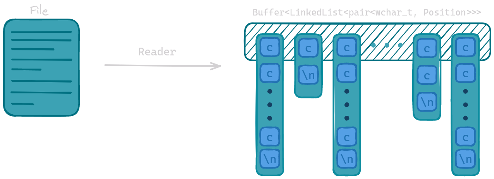
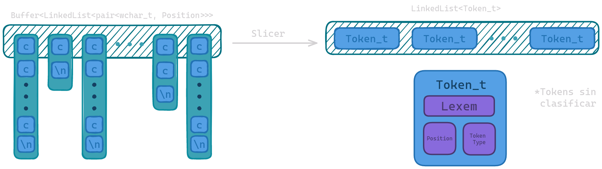

# Mutavol

## Descripción

**Mutavol** es un sencillo proyecto que combina un analizador léxico y un analizador
sintáctico para pseudocódigo.

El analizador léxico se encarga
de reconocer los tokens del lenguaje y el analizador sintáctico se encarga de verificar
que la secuencia de tokens sea correcta.

## Uso

***Atención:*** Mutavol aún se encuentra en desarrollo por lo que el executable principal (`mtv`) aún no funciona
adecuadamente. Sin embargo, el ejecutable (`mtvt`) que corresponde a la versión de pruebas se encuentra operativo. Para
compilarlos se debe usar el siguiente comando en la carpeta raíz del proyecto:

```Bash
cmake -B build -S .
```

Esto generará una carpeta `build` necesaria para alojar el ejecutable. Después colocar el siguiente comando:

```Bash
cmake --build build --target mtvt
```

Para ejecutar, debe buscar el binario de salida en la carpeta `build`, dependiendo del generador usado, este se puede
encontrar dentro de otra sub-carpeta `Debug`. Para probarlo puede usar el archivo [test_code.cpp](./test_code.cpp) y
observar la salida.

```Bash
./build/mtvt -i ./test_code.cpp
```

## Estructura

El proyecto está dividido en tres módulos o carpetas principales:

- `Args`: Módulo encargado del procesamiento de los argumentos pasados al programa.
- `Core`: Módulo encargado de la lógica principal del programa.
- `Utils`: Módulo encargado de funciones auxiliares así como estructuras de
  datos necesarias para el funcionamiento del programa.

## Funcionamiento

A continuación se detallarán los pasos que sigue el programa para analizar un archivo

### Fase 0: Procesamiento de argumentos

Mutavol recibe 4 parámetros de manera general, 2 de ellos corresponder a la versión y
a la ayuda mientas que los restantes corresponden al archivo de entrada y salida, este
último opcional.

La manera en que se implementó esta funcionalidad es mediante la creación del módulo
`Args` que se encarga de procesar los argumentos pasados al programa mediante el uso
de banderas o *flags*.

Las banderas posibles del programa se detallan a continuación:

- `-h` o `--help`: Muestra la ayuda del programa.
- `-v` o `--version`: Muestra la versión del programa.
- `-i` o `--input`: Especifica el archivo de entrada.
- `-o` o `--output`: Especifica el archivo de salida.

\* Si no se especifica un archivo de salida, el programa imprimirá en la salida
estándar.

Si el programa recibe una bandera no reconocida, se mostrará un mensaje de error y se
cerrará. De igual forma, si el programa recibe una bandera que requiere un argumento o
si no se especifica una bandera que lo requiera, se finalizará la ejecución del
programa.

***Nota***: Más información en [Args](./docs/args.md).

##### *Características del código:*

- Se ha empleado el patrón de diseño *Singleton* para la clase `Args`.
- El código permite la especificación de archivos tanto para sistemas Windows como
  para sistemas Linux.

### Fase 1: Análisis Léxico

El análisis léxico se realiza después de identificar el archivo a trabajar. La clase encargada de realizar esta tarea es
`Scanner`. Este consta de tres submódulos que se ejecutan secuencialmente:

- `Reader`: Módulo encargado de la lectura de archivos, almacena el contenido en un `Buffer`.
- `Slicer`: Módulo encargado de la concatenación de caracteres, lee el buffer y transforma el Buffer de caracteres a un
  Buffer de tokens sin identificar
- `Clasiffier`: Módulo encargado de clasificar el token que se está obteniendo mediante el Slicer. En caso de
  encontrarse con un token sin reconocer arrojará un error.

A continuación se detallarán las sub-fases que componen el análisis léxico:

#### Fase 1.1: Reader

Una vez que el módulo `args` ha procesado los argumentos, se procede a leer el archivo
especificado en la bandera `-i` o `--input`.

Aquí empieza el trabajo del analizador léxico, este contiene un submódulo
llamado `Reader` Este módulo se complementa con una estructura de datos llamada `Buffer` que se encuentra en
su propio submódulo dentro del `Core`. La estructura `Buffer` se encarga de almacenar
el contenido del archivo leído además de información sobre la posición del caracter en
el archivo.

- Paso 1: Se verifica la existencia del archivo mediante la función `verify()` de reader.
- Paso 2: En la función `read_file()` se convierte el archivo a un
  `std::vector<wchar_t>` donde están almacenados los caracteres del archivo.
- Paso 3: Se crea un buffer con el contenido del archivo, agregando datos como la
  posición del caracter en el archivo (estructura `Position`).
- Paso 4: Se realiza una limpieza en la que se eliminan comentarios de una línea (`//`)
  y comentarios de bloque (`/* */`), además de suprimir líneas vacías.

<div style="text-align: center;">

</div>

##### *Características del código:*

- La clase `Reader` implementa el patrón de diseño *Singleton*.
- La clase `Buffer` implementa el patrón de diseño *Singleton*, sin embargo, la clase
  hace uso de los templates por lo que cada tipo con la que se use, generará una nueva
  instancia *Singleton*.
- Se crearon estructuras de datos auxiliares como listas enlazadas (`LinkedList`) y
  `Position` para el manejo de la información del archivo.
- Para las listas enlazadas se implementó el patrón de diseño *Iterator*.
- Se implementó el patrón de diseño *Factory* para la creación de instancia de `Node`
  y `LinkedList`.

***Nota***: Más información en [Reader](./docs/reader.md) y [Buffer](./docs/buffer.md).

#### Fase 1.2: Slicer

Después de realizado la lectura del archivo, la clase `Slicer` se encarga de convertir los caracteres almacenados en el
buffer, en una secuencia de token que mandará al `Classifier`.
El slicer recorre el Buffer de caracteres y mediante funciones verifica el tipo de cada uno, en casos de espacios y
caracteres vacíos, se omiten.



##### *Características del código*

- La clase `Slicer` implementa el patrón de diseño *Singleton*
- El Slicer hace uso de la subclase *Buffer::Iterator* que permite un mejor recorrido del contenido del archivo

***Nota***: Más información en [Slicer](./docs/slicer.md) y [Tokens](./docs/tokens.md).